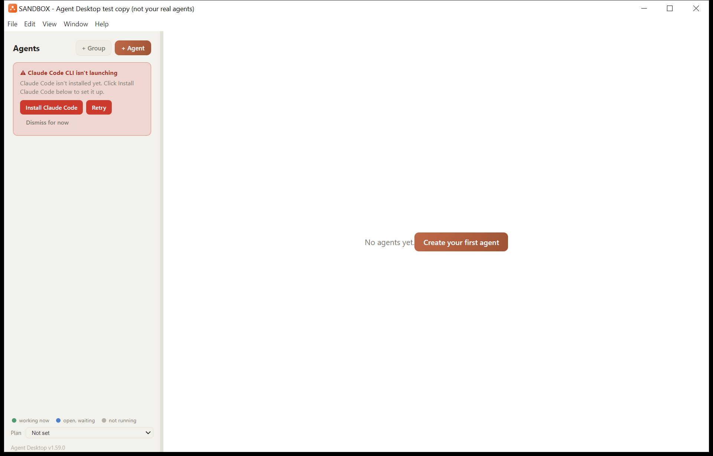

# Agent Desktop

A desktop app for running and managing several [Claude Code](https://claude.com/product/claude-code) CLI sessions side by side — one dashboard, one chat-style view per agent, instead of a wall of terminal tabs.

If you've ever ended up with five terminal windows each running `claude` for a different project and lost track of which one needed your attention, this is for that.

## Download and install (Windows)

Not a developer? This is the section for you — no Node, npm, or git needed.

1. Go to this repo's [Releases](../../releases) page and download the latest **Setup .exe** (or, if you'd rather not install anything, the portable **.zip** — unzip it anywhere and run `Agent Desktop.exe` directly).
2. Run the Setup file. Windows will likely show a blue **"Windows protected your PC"** SmartScreen warning — that's expected, the app isn't code-signed yet. Click **More info**, then **Run anyway**.
3. Follow the installer (you can change the install location if you want to).
4. On first launch, Agent Desktop asks where you'd like your agents to live — pick a folder (an empty one is fine; it defaults to `Documents\Agent Desktop`).
5. If Claude Code isn't already installed, click **Install Claude Code** when prompted — this runs the official installer and only takes a minute.
6. Sign in with your own Claude account when asked.
7. Click **+ Agent** to create your first agent, and you're set.

**Requirements:** Windows 10/11 (x64) and a Claude account. That's it — no Node.js, npm, or git required for this route.

> A one-time note on Claude Code's status line: Agent Desktop installs a small status-line script into your global Claude Code config the first time it runs, so the sidebar's usage badges can show Anthropic's real reported numbers instead of an estimate. It only ever does this if you don't already have a status line configured — it will never overwrite one you've set up yourself.



## What it does

- **A sidebar of agents.** Each agent is just a folder on disk. Add one, and Agent Desktop dispatches a real, native Claude Code background agent (`claude --bg`) for it — the actual CLI's own multi-agent system, not a reimplementation.
- **Groups to organize the sidebar.** Collect agents into colored, collapsible groups ("+ Group" in the sidebar), drag agents between them, and reorder groups by dragging their headers. **Groups are purely a visual aid** — they do not define reporting lines, which agent is a "manager", or any relationship between agents. What an agent does and answers to lives in that agent's own instructions (its `CLAUDE.md`), not in how it's grouped here. Group definitions live in one `agent_groups.json` file next to your agent folders; agents you haven't placed in a group show under "Ungrouped".
- **Restart an agent's process without losing the conversation.** A "Restart Session" button re-dispatches the agent's background process while resuming the same conversation — so it re-reads its `.claude/settings.local.json` and `CLAUDE.md` (which a normal app restart doesn't, since that just re-attaches to the still-running process). Distinct from "Reset Session", which clears the conversation.
- **Edit an agent's instructions in-app.** The Create/Edit Agent form has an "Instructions" field, and each agent's `⋮` menu has "Edit instructions" — both write the agent's `CLAUDE.md`, the file Claude Code loads as that agent's standing instructions every session. (This is separate from the short "Role description", which is only the sidebar blurb.) The `⋮`-menu editor adds a starter template and an overwrite-vs-reload prompt if the file changed on disk. Changes take effect on the agent's next session. An agent with no `CLAUDE.md` yet shows a one-click nudge to add one.
- **A chat view, not a raw terminal.** Messages, tool calls, and responses are parsed out of the session's own transcript and shown as a normal chat thread, with Markdown rendered — headings, bold, lists, code blocks, blockquotes, and tables — so a long answer is easy to scan. A "Raw Terminal" toggle drops back to the literal terminal when you want it.
- **Clickable PDF paths in replies.** When an agent mentions a local PDF by its full Windows path (plain text, `inline code`, a code block, or a `[text](D:\...\file.pdf)` link), the path becomes a link that opens the file in your default PDF reader. For safety the app opens only existing `.pdf` files inside the agents' workspace folder and its working-files folder (both set in `src/main.js`, `PDF_LINK_ROOTS`). Anything else is refused and logged to `pdf-links.log` in the app's data folder, and a non-PDF is never opened.
- **Status at a glance.** Each agent can maintain its own `master_state.md` (status / health / recent tasks) that shows up as a one-line summary in the sidebar, so you can tell what's going on without opening every agent.
- **Conversation archive.** Sessions get archived to per-day markdown files, browsable without digging through raw JSONL.
- **A Chats panel per agent.** Lists that agent's past conversations — the same set claude.ai/code shows under "Recents" — newest first, with titles, a preview line, and when each was last active. Rename any of them inline; the new name is written the same way the CLI's own `--name` writes it, so it also surfaces on claude.ai/code. (Resuming an older conversation in place and starting a fresh one from this panel are built but not yet enabled — see the project notes.)
- **Every agent reachable from your phone or another device, automatically.** Right after each agent's first (or first-since-restart) dispatch, Agent Desktop runs Claude Code's own `/remote-control` for it and answers the confirm prompt, so it shows up on claude.ai/code and the mobile app with no manual step. Entirely silent — you'd never see it happen.
- **Runs the real CLI, on Claude Code's own infrastructure.** No wrapper reimplementation of Claude Code — Agent Desktop dispatches each agent as a genuine Claude Code background agent and just `attach`es a [node-pty](https://github.com/microsoft/node-pty) view onto it, so anything the CLI's own background-agent system can do, an agent here can do. Because the agent is a real Anthropic-side background agent rather than a process Agent Desktop directly owns, it keeps running independent of whatever's currently attached to it - closing Agent Desktop (or losing the attach connection) doesn't kill the agent's work.
- **Tells you when the Claude Code CLI itself is outdated.** Agent Desktop depends on its own separate, npm-global Claude Code install (distinct from whatever the Claude Desktop app bundles) - a sidebar button appears only when that install is genuinely behind the latest published version, and updates it with one click.
- **Real rate-limit usage in the chat header, not a guess.** On first launch, Agent Desktop installs a small [statusLine](https://code.claude.com/docs/en/statusline) script as your global Claude Code config (only if you don't already have one configured - it never overwrites your own). From then on, any interactive `claude` session on the machine - this app's own agents included - feeds it Anthropic's actual reported 5-hour/weekly rate-limit percentages, which show up as real badges instead of an estimate. Falls back to a labeled, message-count-based estimate until that data exists (e.g. right after first install) - the sidebar's **Plan** dropdown (Pro / Max 5x / Max 20x) picks which community-sourced estimate that fallback uses.
- **A "this month" view too**, alongside the 5-hour/weekly ones - real message counts for the current calendar month, a daily average, and a plain linear projection for where that pace lands by month's end, plus a clearly-labeled *estimated* percentage (extrapolated from your real weekly rate-limit usage - Anthropic doesn't publish a monthly cap the way it does for the 5-hour and weekly windows, so this is the best available estimate, not a reported figure).

## Requirements

- Windows (developed and tested there; the Electron/node-pty parts are cross-platform in principle, but paths and the launch scripts currently assume Windows)
- [Node.js](https://nodejs.org/) 18+
- [Claude Code](https://claude.com/product/claude-code) installed and authenticated (`claude` on your `PATH`)

## Setup

```bash
git clone <this repo>
cd agent-desktop
npm install
npm start
```

By default, agents live as sibling folders next to `agent-desktop` itself — i.e. if you clone this into `C:\Projects\agent-desktop`, agent folders go in `C:\Projects\`. Set the `AGENT_DESKTOP_ROOT` environment variable if you'd rather keep them somewhere else. If that folder has other non-agent subfolders you don't want listed as agents, list them (comma-separated) in `AGENT_DESKTOP_EXTRA_EXCLUDE`.

## Adding an agent

Click **+ Agent** in the sidebar and give it a name. That creates a folder for it with:

- `agent_config.json` — display name, role description, avatar
- `master_state.md` — optional status doc the agent can keep updated (`## Status`, `## Health`, `## Recent Tasks` sections are parsed and surfaced in the sidebar)
- `sessions/` — where its conversation archive gets written

Selecting the agent starts a real `claude` session with that folder as its working directory — the same as running `claude` yourself in that folder, just with a UI around it.

## Architecture, briefly

- `src/main.js` — Electron main process: window management, dispatching each agent as a native Claude Code background agent (`claude --bg`) and attaching a node-pty view to it (`claude attach`), IPC handlers. One-shot CLI calls (listing agents, dispatching, stopping) go through node-pty rather than `child_process`, since the latter has proven unreliable in some launch contexts on Windows.
- `src/agents.js` — agent folder CRUD (create/list/update/delete).
- `src/groups.js` — reads/writes `agent_groups.json` (the sidebar's visual groups). Normalizes on every read and write, and falls back to "no groups" if the file is missing or corrupt, so a bad edit can never break the sidebar.
- `src/archive.js` — reads each agent's live JSONL transcript and turns it into the chat view's message blocks, plus the per-day markdown archive.
- `src/fsRetry.js` — retry-with-backoff wrapper for file operations, since cloud-synced folders (Dropbox, OneDrive, etc.) and antivirus/security software can transiently lock files mid-write.
- `src/renderer/` — the UI itself.

## Packaged vs unpackaged behaviour

Running from source (`npm start`, i.e. `!app.isPackaged`) and running an
installed build (the Setup `.exe` or the portable `.zip` — see "Download and
install" above if this repo has that section) differ in a few places, all of
it added for a packaged install running on a machine that has none of the
things a from-source checkout can assume:

- **Where agents live.** Unpackaged, agents are sibling folders next to
  `agent-desktop` itself (or `AGENT_DESKTOP_ROOT`, unchanged - see Setup
  above). A packaged install has no such parent folder, so on first run it
  asks you to pick one (a folder picker, defaulting to `Documents\Agent
  Desktop`, created if it doesn't exist) and remembers the choice in a
  `settings.json` inside the app's data folder. An empty or freshly-picked
  folder just means an empty agent list with a "Create your first agent"
  button — nothing else changes.
- **The Claude Code CLI.** Unpackaged, this app manages its own private npm
  install of the CLI under its data folder (see `privateCli*` in
  `src/main.js`), which needs Node.js on the machine. A packaged install has
  no such guarantee, so it prefers a native `claude.exe` install instead
  (the official installer, `irm https://claude.ai/install.ps1 | iex`,
  installing to `%USERPROFILE%\.local\bin`) — offering an in-app "Install
  Claude Code" button when nothing is found at all. `resolveClaudeExecutable()`'s
  order for a packaged install is: the private npm CLI if one is already set
  up → a native `claude.exe` → anything already on `PATH` → the install
  prompt. Signing in and updating both work the same way either route got
  there.
- **The ARGUS/Bridge tab, the Library tabs, and the Telegram/Tasks panels.**
  These all read from shared workspace folders/scripts that only exist on
  the original developer's own machine (`shared_reports`, `shared_registry`,
  a Telegram-bridge task queue). A packaged install hides each of these
  outright rather than showing them permanently empty — an agent's own
  `OPEN NOW` list in the Tasks panel still works regardless, since that's
  read from the agent's own folder, not a shared one.
- **The Plan badge.** Unpackaged, the 5-hour usage estimate falls back to a
  known default plan read from a workspace-local `infrastructure_facts.md`.
  A packaged install has no such file and no reason to assume any particular
  plan, so the badge reads "Plan: not set" until you pick one from the
  sidebar's Plan dropdown.
- **User-visible text.** A handful of UI strings that used to name the
  original developer by name now say "you" instead — this never affected
  behaviour, only wording.

Everything else — the sidebar, the chat view, groups, the conversation
archive, restart/reset, and so on — behaves identically either way.

## Known limitations

- Windows-first: paths and the hidden-launch script (`Launch.vbs`) assume Windows conventions.
- Only one Agent Desktop window should run at a time per machine (enforced via Electron's single-instance lock) — a second launch just focuses the first.
- Deleting an agent shows a mandatory 30-second countdown before the delete button becomes clickable. This isn't just friction for its own sake: `claude --bg` dispatch spawns a separate, longer-lived daemon helper process that can keep a handle on the agent's folder for a while after the agent session itself is stopped, and deleting too soon can otherwise fail with a Windows "resource busy" error. The countdown gives that daemon time to release it.

## Troubleshooting: "File not found" / "is not recognized" launching an agent ("the 2 sec problem")

**Check this one first** if an agent won't open or respond — it's the most common cause and the fastest to rule in or out.

If opening or messaging an agent fails with an error mentioning `claude.cmd`
— e.g. `'C:\Users\<you>\AppData\Roaming\npm\claude.cmd' is not recognized as
an internal or external command` — and this keeps happening rather than
being a one-off blip, the real cause on a machine with the Claude Desktop
app installed is almost always this: **`%APPDATA%\npm\claude.cmd` is not an
independent file, it's a symlink into Claude Desktop's own packaged app
storage**, and that symlink is not reliably resolvable from every process's
security context. Confirm it in one command:
```powershell
Get-Item "$env:APPDATA\npm\claude.cmd" | Select-Object LinkType, Target
```
If `LinkType` shows anything (e.g. `SymbolicLink`) and `Target` points into
`...\Packages\Claude_<id>\LocalCache\...`, that's it — some processes will
be able to resolve that target reliably and others won't, depending on
their own relationship to Claude Desktop's app-package identity, which
produces exactly this kind of "works sometimes, fails other times, no
obvious pattern" symptom.

This app's own `resolveClaudeExecutable()` (`src/main.js`) already works
around it by resolving straight to the real target path instead of through
the symlink — if you're hitting this in your own tooling that shells out to
`claude`, the fix is the same: resolve
`%LOCALAPPDATA%\Packages\Claude_*\LocalCache\Roaming\npm\claude.cmd`
directly (glob for the `Claude_*` folder, since the exact suffix is
per-install) rather than trusting the PATH/`%APPDATA%`-based symlink.

## Troubleshooting: Windows Defender Controlled Folder Access

If file edits or agent sessions fail or hang for no visible reason on Windows, check whether Controlled Folder Access is silently blocking Node, git, or `claude.exe` itself from writing to your agents' folder:
```powershell
Get-WinEvent -FilterHashtable @{LogName='Microsoft-Windows-Windows Defender/Operational'; Id=1123} -MaxEvents 10
```
If it's blocking something, allow-list the specific executable named in the event (an admin PowerShell is required):
```powershell
Add-MpPreference -ControlledFolderAccessAllowedApplications "<path to the .exe>"
```
Wildcards are supported in the *folder* portion of the path (not the filename) — useful for auto-updating apps whose install path includes a version number, e.g. `...\claude-code\*\claude.exe`.

## Contributing

Issues and PRs welcome — this is an early, actively-used personal tool being shared in case it's useful to others, not a finished product. Bug reports with repro steps are especially appreciated, since a lot of the trickier issues so far have been Windows/filesystem-specific and hard to hit by just reading the code.

## License

MIT — see [LICENSE](LICENSE).
